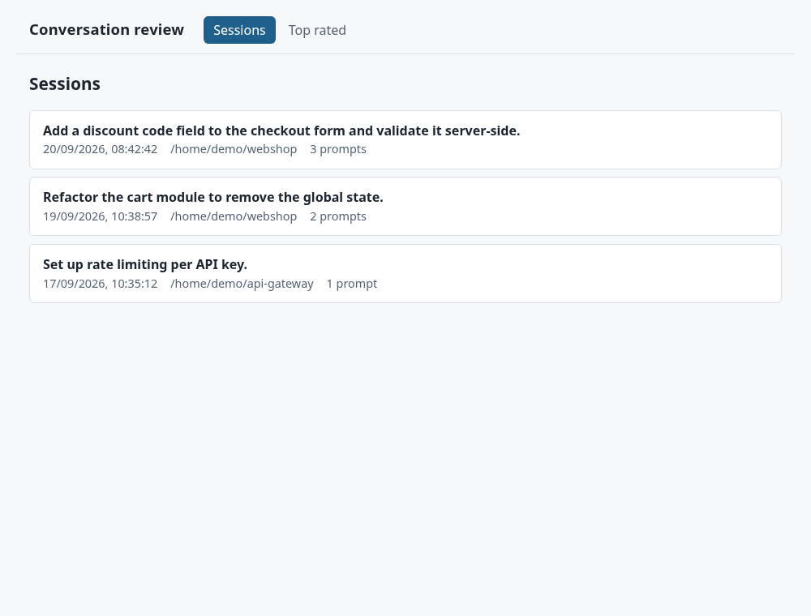
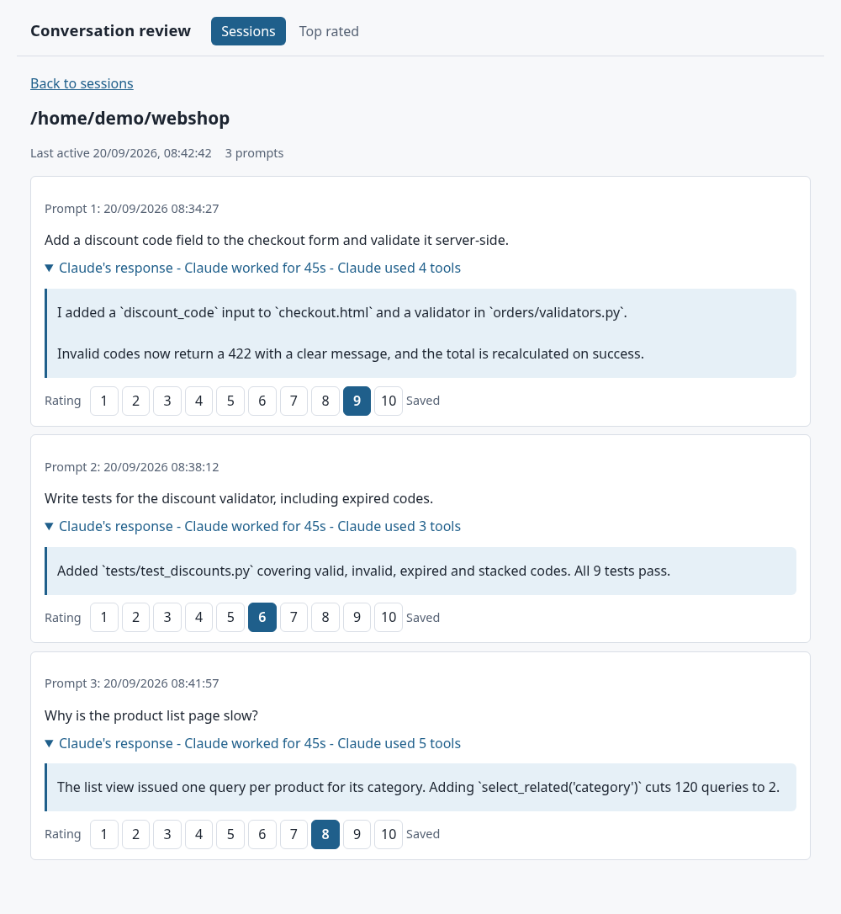
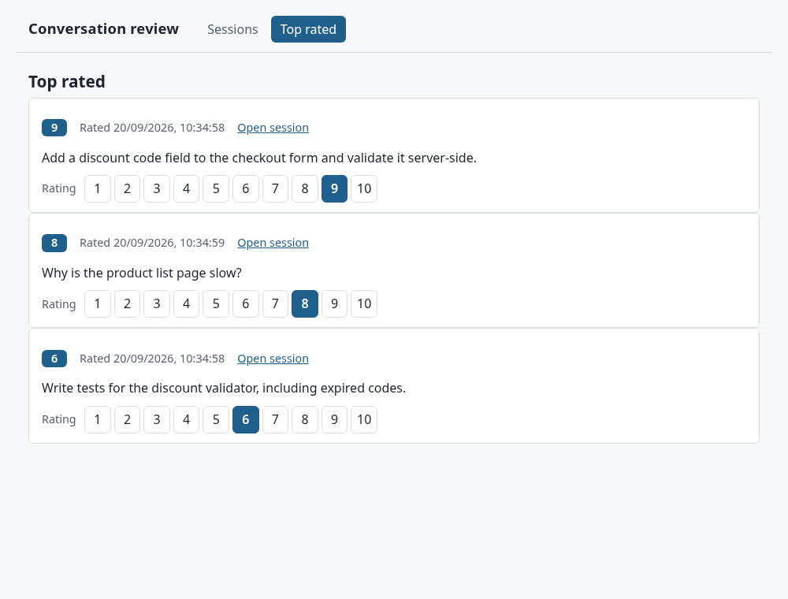

# Prompt Rating WUI

A small, localhost-only web tool for reviewing and rating the prompts you gave Claude Code.
It reads your existing Claude Code CLI session history, lets you browse each session's prompts
and Claude's responses, and rate every prompt from 1 to 10 so you can find your best ones later.

Python 3 standard library only — there is nothing to install.

## Features

- **Browse sessions** — paginated list of past sessions, most recent first.
- **Search recent prompts** — search prompt text across all sessions from the last 7 days.
- **Review prompts** — prompts in order, with expandable responses, activity summary and response time.
- **Rate 1–10** — ratings persist across reloads; re-rating replaces the old value.
- **Top Rated view** — highest rated first, ties broken by most recently rated; re-rate inline.
- **Favorite Prompts view** — save your own prompt drafts locally and edit them inline.
- **Safe by default** — binds to `127.0.0.1:5148` only; long content truncated behind "show more".
- **Resilient** — malformed session files are skipped or flagged, and a corrupted ratings file can be reset from the UI.

## Screenshots

Demo data only — these are synthetic sessions, not real conversations.

**Sessions** — most recent first



**Session detail** — expandable responses and a 1–10 rating per prompt



**Top rated** — best prompts across all sessions, re-rate inline



## Quick start

Requires Python 3.9+ and at least one existing Claude Code session under `~/.claude/projects/`.

```bash
python3 -m src.server
# Serving on http://127.0.0.1:5148
```

Open the printed URL. On VS Code remote-SSH or a devcontainer, use the forwarded port it offers.

## Data

- Sessions are read (never modified) from `~/.claude/projects/**/*.jsonl`.
- Ratings are stored in `~/.claude/claude-rating-tool/ratings.json`.
- Favorite prompts are stored in `~/.claude/claude-rating-tool/favorites.json`.

Favorite prompts are your own saved prompt drafts. They are separate from rated session prompts, which are still discovered from Claude Code session history and stored by rating only.

## Tests

```bash
python3 -m unittest discover -s tests -t .
```

## Project layout

| Path | Purpose |
| --- | --- |
| `src/discovery/` | Finds session files |
| `src/parsing/` | Parses `.jsonl` sessions into prompts and responses |
| `src/ratings/` | Ratings store |
| `src/favorites/` | Favorite prompt store |
| `src/server/` | HTTP server and API |
| `src/web/static/` | Frontend (HTML/CSS/JS, no build step) |
| `specs/` | Spec-Kit specification, plan, tasks and API contract |

See `specs/001-conversation-rating-tool/` for the full spec and HTTP API contract.
